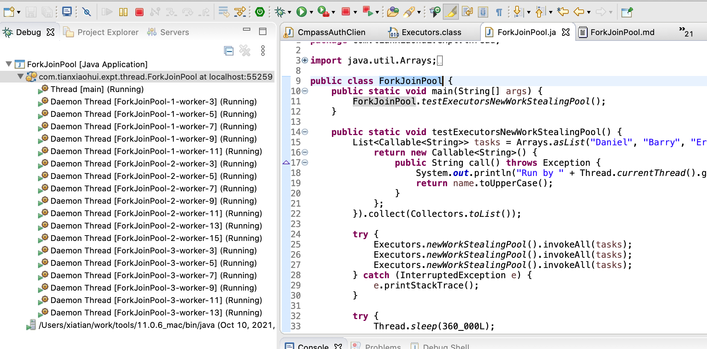
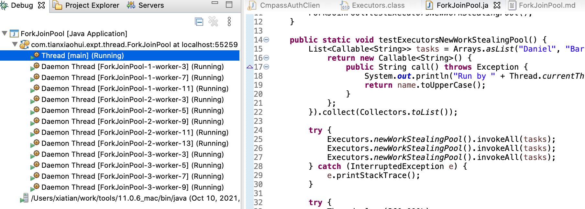

# Executors.newWorkStealingPool()

以 debug 方式运行 [ForkJoinPool](../../src/main/java/com/tianxiaohui/expt/thread/ForkJoinPool.java) 的 main 方法, 观察线程的变化. 

可以观察到以下现象:
1. Executors.newWorkStealingPool() 是使用的 ForkJoinPool 的线程池, 默认开和 CPU 个数一样多的 worker 线程;
2. 这些线程过一段时间没有被使用会自动被停掉, 直到完全消失;

更多: [Java ForkJoinPool 的 worker thread 是如何自我终止的?](http://www.tianxiaohui.com/index.php/default/Java-ForkJoinPool-%E7%9A%84-worker-thread-%E6%98%AF%E5%A6%82%E4%BD%95%E8%87%AA%E6%88%91%E7%BB%88%E6%AD%A2%E7%9A%84.html)
