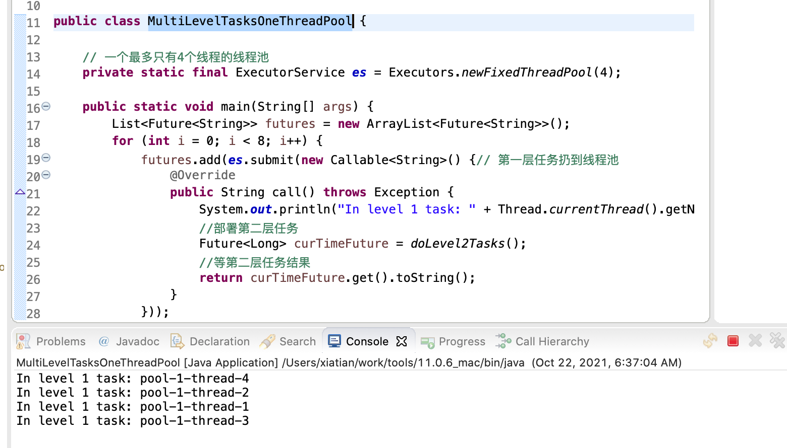

# MultiLevelTasksOneThreadPool

先声明一个只有4个固定线程的线程池, 同时启动第一层8个任务, 同时第一层8个任务里面每个再启动一个二层任务, 第一层和第二层任务扔到同一个线程池. 同时第一层任务会以 block 的方式等第二层任务结束. 由于只有4个工作线程, 所以第一层任务都无法正常被执行, 第二层任务也无法执行, 所以导致已经在执行的第一层任务都无法结束, 最终这个程序无法正常结束.

